# 📚 BookStore API

A clean, minimal REST API built with Node.js + Express for managing books and user reviews. It includes JWT authentication and async examples (callbacks + promises).

## 🚀 Quick Start
- Prerequisites: Node.js 18+
- Install dependencies:
  - `npm install`
- Start the API (default `http://localhost:3000`):
  - `npm start`
- Choose a custom port:
  - PowerShell: `$env:PORT=3001; npm start`

Run the demo script (calls endpoints and prints results):
- `npm run demo`

## 🔗 Endpoints
- `GET /books` — list all books
- `GET /books/isbn/:isbn` — book details by ISBN
- `GET /books/author/:author` — books by author (exact match, case-insensitive)
- `GET /books/title/:title` — books by title (partial, case-insensitive)
- `GET /review/:isbn` — reviews for a book
- `POST /register` — create user `{ username, password }`
- `POST /login` — returns `{ token }` (JWT)
- `POST /auth/review/:isbn` — add/update review `{ review }` (requires `Authorization: Bearer <token>`)
- `DELETE /auth/review/:isbn` — delete your review (requires `Authorization`)

## 🖥️ Call from Terminal
PowerShell (`Invoke-RestMethod`):
- Find by title: `Invoke-RestMethod http://localhost:3000/books/title/clean`
- With spaces: 
  - `$t = "Clean Code"; $e = [System.Uri]::EscapeDataString($t); Invoke-RestMethod "http://localhost:3000/books/title/$e"`
- Login: `Invoke-RestMethod -Method Post -Uri http://localhost:3000/login -ContentType 'application/json' -Body '{"username":"hamza","password":"pass123"}'`
- Add review: `Invoke-RestMethod -Method Post -Uri http://localhost:3000/auth/review/9780002 -ContentType 'application/json' -Headers @{ Authorization = "Bearer <TOKEN>" } -Body '{"review":"Excellent livre!"}'`

curl:
- `curl http://localhost:3000/books/title/clean`
- `curl -X POST http://localhost:3000/login -H "Content-Type: application/json" -d '{"username":"hamza","password":"pass123"}'`

> Tip: If port 3000 is busy, use `$env:PORT=3001; npm start` and replace `3000` with `3001` in commands.

## 📸 Screenshots (docs/)
These are sample captures of the API in action:

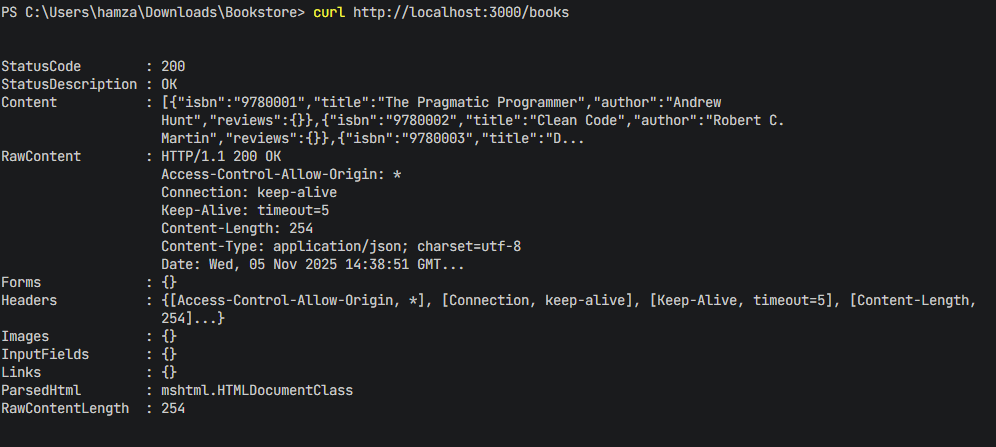
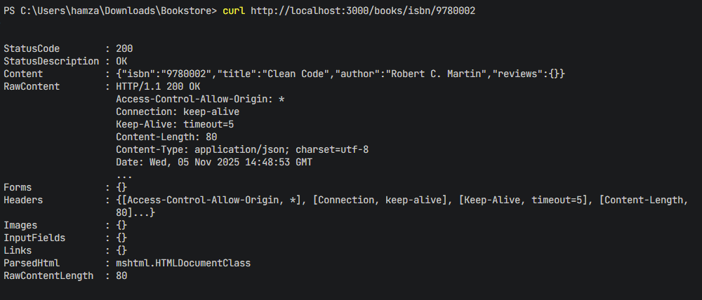
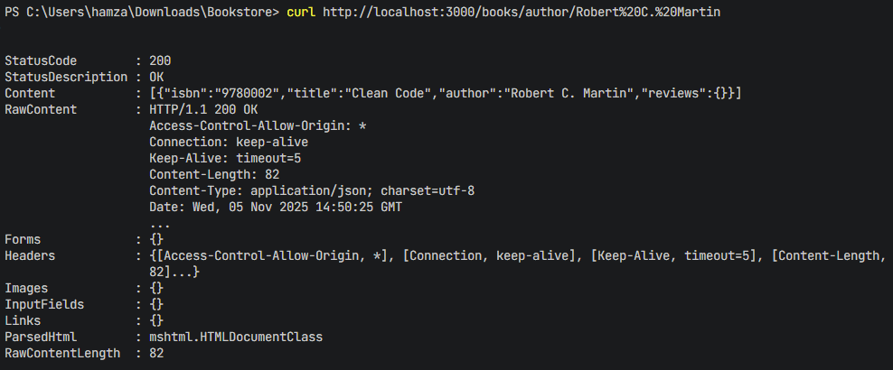
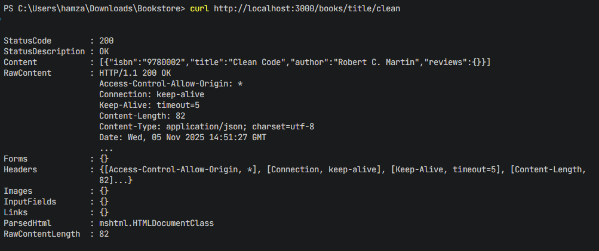
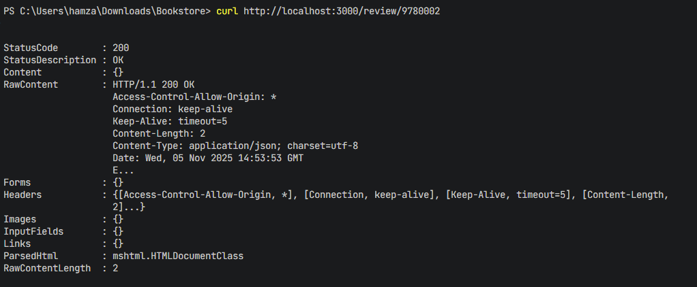
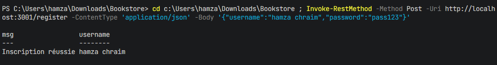
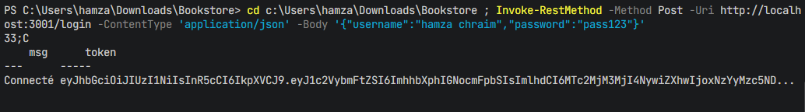
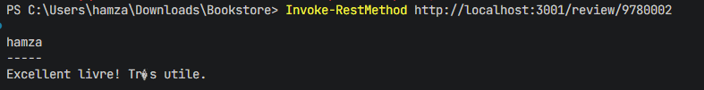

Additional examples:

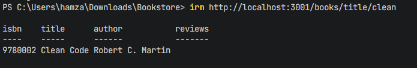
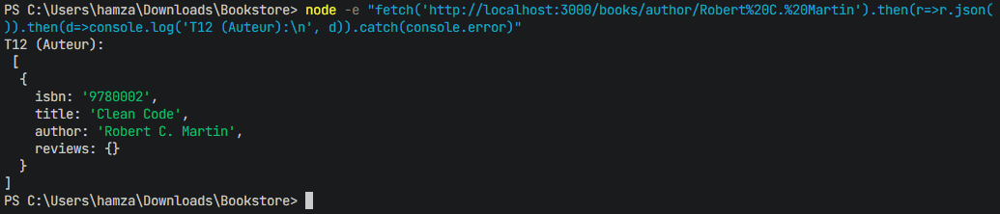
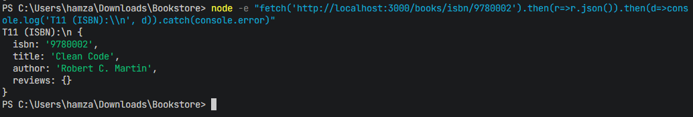
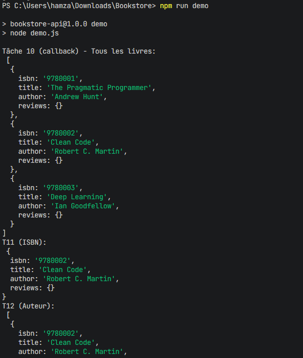

## 📚 Async Demo (Tasks 10–13)
- Callback example fetching all books (Task 10)
- Promise-based searches: ISBN, author, title (Tasks 11–13)

## 🛡️ Auth Notes
- Use `POST /login` to get a JWT.
- Send `Authorization: Bearer <token>` for `/auth/*` routes.
